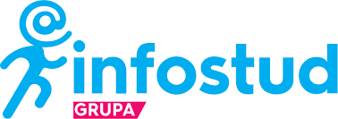

## Welcome to DS Bootcamp in R

> You have more likely than not heard about the science of data; you may think of a world of clever people typing away at their computers in a language that is alien to you. If you are thinking this, you are not aware of the potential of data literacy to make your life, company, or institution better educated and more insightful and dynamic than your colleagues and competitors. 

{width=60% height=60%}

> [**R**](https://www.r-project.org/) together with [**RStudio**](https://rstudio.com/) is the best data science tool! It is open source and free software that is available to anyone with a desire to discover, learn, explore, experience, expand and share the algorithms of their data science journey. 

##### Data literacy is an essential part of a data-driven culture. In this course we will teach you to ‘master and speak data’ by taking a step by step approach from the beginning to identify unseen details and to produce visual data stories and data predictions. You will learn the basics of descriptive statistics and exploratory data analysis, statistical modelling, statistical tests as well as machine learning techniques. 

##### The content of the course is designed to inform, motivate and equip you to use data as part of your everyday language, empowering you and making you more productive in your daily work.

## Install R

To begin your journey to data science in R you need to install and make sure you can run it.

You should start by installing R first and then RStudio. The analogy we can use here is that R is an airplane and R Studio is its airport.

* R homepage - <http://www.r-project.org>
* CRAN Mirrors - <http://cran.r-project.org>

{width=50% height=50%}

Run the installation

{width=50% height=50%}

Your R Console should look something like this:

{width=50% height=50%}

## Install RStudio

RStudio is available in open source and commercial editions and runs on the desktop (Windows, Mac, and Linux).

Click on RStudio Desktop - <https://rstudio.com/products/rstudio/download/>, there should be a button to download it.

{width=50% height=50%}

Once installed it should look like this when opened:

{width=60% height=60%}

RStudio is an integrated development environment (IDE) for R. It includes a console, syntax-highlighting editor that supports direct code execution, as well as tools for plotting, history, debugging and work-space management. You can check its features by visiting the [RStudio website](https://www.rstudio.com/products/rstudio/features/).

### **We recommend you check regularly for R/Rstudio updates.**

If you are having any difficulties with the preparation of your system for the course, do not worry. We will see you on Wednesday, 03-March and help you get up and running.

---

##### **We are looking forward to our data science journey with R!** 

[{width=10% height=10%}](https://sisteranalyst.org)

**In partnership with**

[{width=10% height=10%}](https://www.infostud.com)

